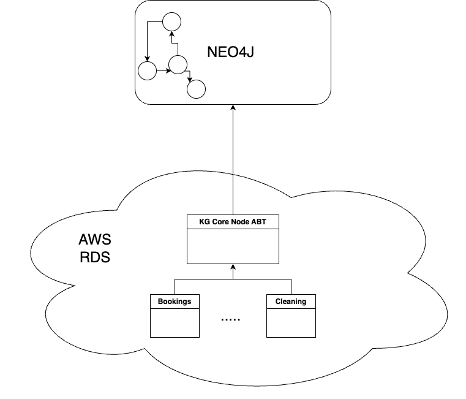
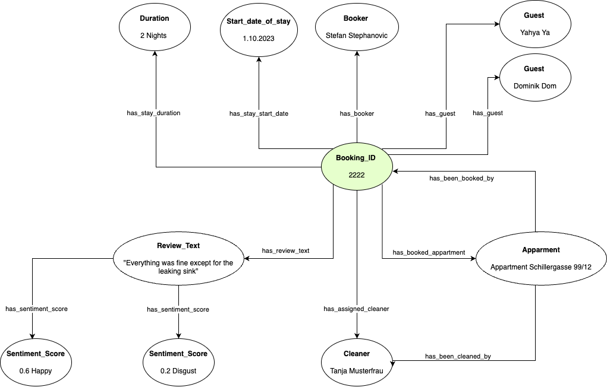

# Knowledge Graphs for the win! 

```
                                   /\
                              /\  //\\
                       /\    //\\///\\\        /\
                      //\\  ///\////\\\\  /\  //\\
         /\          /  ^ \/^ ^/^  ^  ^ \/^ \/  ^ \
        / ^\    /\  / ^   /  ^/ ^ ^ ^   ^\ ^/  ^^  \
       /^   \  / ^\/ ^ ^   ^ / ^  ^    ^  \/ ^   ^  \       *
      /  ^ ^ \/^  ^\ ^ ^ ^   ^  ^   ^   ____  ^   ^  \     /|\
     / ^ ^  ^ \ ^  _\___________________|  |_____^ ^  \   /||o\
    / ^^  ^ ^ ^\  /______________________________\ ^ ^ \ /|o|||\
   /  ^  ^^ ^ ^  /________________________________\  ^  /|||||o|\
  /^ ^  ^ ^^  ^    ||___|___||||||||||||___|__|||      /||o||||||\
 / ^   ^   ^    ^  ||___|___||||||||||||___|__|||          | |
/ ^ ^ ^  ^  ^  ^   ||||||||||||||||||||||||||||||oooooooooo| |ooooooo
ooooooooooooooooooooooooooooooooooooooooooooooooooooooooooooooooooooo
```
Short-Term Renting business is hard, but without the right monitoring tools for customer satisfaction, it is even harder(then it has to be).
This Repo utilizes modern Knowledge-Graph Approaches to assist hotels and short-term rental businesses in identifying problems (before they occure).

More to come soon...


### Architecture
This application utilizes Company Data that is currently stored in a AWS RDS in multiple tables using the architecture displayed in Image 1. 



In order to create KGs, initially an ABT according to the following Object Model (Image 2) has been created and : 




