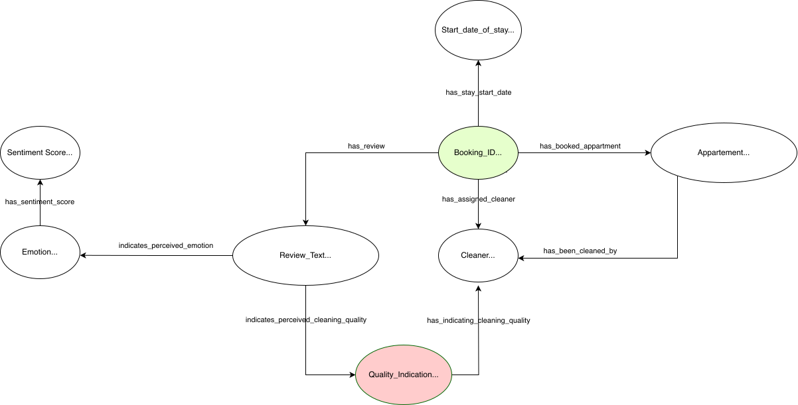

# Knowledge Graphs for the win! 

```
                                   /\
                              /\  //\\
                       /\    //\\///\\\        /\
                      //\\  ///\////\\\\  /\  //\\
         /\          /  ^ \/^ ^/^  ^  ^ \/^ \/  ^ \
        / ^\    /\  / ^   /  ^/ ^ ^ ^   ^\ ^/  ^^  \
       /^   \  / ^\/ ^ ^   ^ / ^  ^    ^  \/ ^   ^  \       *
      /  ^ ^ \/^  ^\ ^ ^ ^   ^  ^   ^   ____  ^   ^  \     /|\
     / ^ ^  ^ \ ^  _\___________________|  |_____^ ^  \   /||o\
    / ^^  ^ ^ ^\  /______________________________\ ^ ^ \ /|o|||\
   /  ^  ^^ ^ ^  /________________________________\  ^  /|||||o|\
  /^ ^  ^ ^^  ^    ||___|___||||||||||||___|__|||      /||o||||||\
 / ^   ^   ^    ^  ||___|___||||||||||||___|__|||          | |
/ ^ ^ ^  ^  ^  ^   ||||||||||||||||||||||||||||||oooooooooo| |ooooooo
ooooooooooooooooooooooooooooooooooooooooooooooooooooooooooooooooooooo
```

# How to use: 
1. Start the Neo4j database via: 
```shell
docker-compose up -d
```

2. Install all needed packages from  the `requirements.txt`
3. Fill the Neo4j database with the (demo) data
   In case you want to work with the demo data, just run the `populate_KG_with_demo_data` function in `src/KG_Building_Handler.py`.

et voilà, visit http://localhost:7474/browser/ and enjoy the show


### How to use Logic-based Reasoning:
Logic-bases reasoning  as described below, can be applied to the KG by running the `run_logic_based_reasoning()` function in `src/perform_analysis.py`.
The results will be presented in a dedicated streamlit dashboard that can started by running `streamlit run src/dashboards/LBR_dashboard.py`


### How to use Graph Neural Networks
Deep neural network reasoning  as described below, can be applied to the KG by running the `run_GNN_reasoning()` function in `src/perform_analysis.py`.
The results will be presented in a dedicated streamlit dashboard that can started by running `streamlit run src/dashboards/GNN_dashboard.py`


# Introduction
## The Scenario
Short-Term Renting business (STR) is hard, but without the right monitoring tools for customer satisfaction, it is even harder(then it has to be).
This Repo utilizes modern Knowledge-Graph Approaches to assist hotels and short-term rental businesses in identifying problems regarding their cleaning services and customer satisfactions. 
In particular, it is aiming at identifying if certain appartements or cleaning personals form clusters/sources of exceptionally good or bad customer experiences.
Hence the thereby modeled KG should provided the user with a good structure for all general queries. 

### The Analytics
For this reason, this project provides a presentation layer that displays the following information to the user: 
- A list of cleaning personal that is linked to the best/worst customer experiences. 
- A list of apartments that are linked to the best/worst customer experiences.
- A analysis to identify if certain cleaning people or appartements became a central node in a node of dissatisfaction or form a cluster.
- Advanced analytics of the customer reviews utilizing *BERT* and *TransE*

Eventually, this insight could then be used to infer insights for improvements in cleaning protocols, appartements and eventually customer satisfaction.


# Background
In the hotel/STR business, a common SaaS Stack is the combination of [Kross Booking](https://www.krossbooking.com/en) that provides PMS + Channel Manager + Booking Engine in one solution, in combination with [TimeTac](https://www.timetac.com/en/) that allows 
for smart time tracking of all internal processes. 
While the above is great for managing daily operations, the amount of data insight that can be extracted out of the box is pretty limited and. 
Hence, business owners of certain scales that use the SaaS stack described above are left with high amounts of manual analytical effort with still limited insights   
Therefore, this project tries to reduce the amount of manual effort needed, as well as to increase the quality of insight possible.


## Data Source
For the proposed analytics, following data has been selected and thereby created an analytical base table (ABT) that consists of the following columns: 

| Column Name         | Data Type  | Source   |
|---------------------|------------|----------|
| Booking_ID  (PK)    | INT        | KROSS    | 
| Start_date_of_stay  | TIME STAMP |  KROSS   |
| Appartement         | TEXT       |  KROSS   |
| Cleaner             | TEXT       |  TIMETAC |
| Review Text         | TEXT       |  KROSS   |

This data has been derived (as depicted later on in the architecture section) from two APIs:
1. **Kross Booking**: <br> A plattform that works as datahub for the management of hotels/appartements. In this case, it is used to get access to all booking relevant data
2. **TimeTac**: <br> A plattform that allows to track process times of (cleaning) people. In this case, it is used to track and access data regarding who has cleaned each apartment and when.

### Review Data
In addition (and for advanced analytics), the collected reviews have been (pre-)analyzed with modern NLP-Techniques.
1. **Translation:**
   As the customers of the appartements can (and have been) writing reviews in more than 150 different languages, we have to start out by translating them
   For this purpose, I used the `src/review_process_utils/review_translor.py` script that utilizes Google Translator to translate all reviews (when possible) to english.

2. **Sentiment Analysis**: 
   In order to provide the hotel managers another tool for effective review filtering/pre-selection, initially a sentiment analysis utilizing [DistilRoBERTa](https://huggingface.co/j-hartmann/emotion-english-distilroberta-base)
   has been implemented to categorize the reviews along [Paul Ekman's 6 basic dimensions](https://www.paulekman.com/wp-content/uploads/2013/07/Basic-Emotions.pdf) + one neural. 
   The corresponding script can be found in `src/Review_Handler.py`
   

But for now,this translation and sentiment analysis yielded the following additional review data for the knowledge graph: 

| Column Name            | Data Type |
|------------------------|-----------|
| Booking_ID  (PK)       | INT       |
| Translated_Review_Text | TEXT      |  
| Primary_Emotion        | TEXT      | 

For simplification purposes this table is also stored in the AWS RDS. Of course arguments for storing this data in a NoSQL Table like MongoDB or AWS Dynamo DB could be made, but
due to the limited scope of this project I have decided to keep the overhead low and not setup another DB.


Eventually, this results in the following ABT `ABT_BASE_TABLE_KG_GENERATION` that will be used for building the Knowledge Graph: 

| Column Name            | Data Type  | Source            |
|------------------------|------------|-------------------|
| Booking_ID  (PK)       | INT        | KROSS             |
| Start_date_of_stay     | TIME STAMP | KROSS             |
| Appartement            | STRING     | KROSS             |
| Cleaner                | STRING     | TIMETAC           |
| Translated_Review_Text | TEXT       | KROSS             |
| Primary_Emotion        | TEXT       | ML Model / Manual |
 | Sentiment_Score       | FLOAT      | ML Model / Manual |


**Side Node:**
For this demonstration purpose, the production data has been used and been anonymized using `src/data_anonimizer.py` and stored in `data\demo_data.csv`
Due to my limited local computational power, I have only selected a small sample from the original data.
Nonetheless, this project has been designed in a scalable way and the entirety of the data could be easily processed with the help of more computational power. For example the current setup could also brought to AWS in a similar fashion as the current cloud based components.


# Architecture
As mentioned before, the application utilizes data that has been fetched from *KROSS Booking* and *TimeTac* via their internal APIs is currently stored in a AWS RDS in multiple tables using the architecture displayed below:
<br>
<br>
<br>


<br>
<br>


Original the data is being fetched from the two API's utilizing a python script that runs in a *AWS Lamda Container* that is being executed once per day.
The data fetched, is then stored in extraction tables in an *PostgreSQL* DB stored in an *AWS RDS Instance* (serving as central source of truth) and then automatically (via *AWS Lamda* again) processed into the bespoken ABT.

In the meantime, an adapter (for now, running on-premise in a docker container), is daily fetching new booking data from the ABT, sends the reviews to a sentiment model (`sentiment_model.py`) that returns sentiment scores for each review.
After that, the data gets transformed into a graph-structure and then added to an on-premise *Neo4J* Database (dockerized) to store the KG.

Through this procedure described above, the KG is continuously fed with the newest data available and therefore constantly evolving.


<br>

## Technologies used: 
Starting out, the *AWS Suite* (running *Python* and *PostgreSQL*) was chosen for data fetching, job scheduling and classic RDBS (using PostGRES as Single Source of Truth).
Part of the decision for this technology suit was it's general purpose,it's time/application proven quality, high scalability and wide array of utilities. 
In addition it provides a strong architectural backbone for all kind of ML-Application, being it classic, or graph based, allowing them to flourish in harmony and synergy.


Furthermore *Neo4j* was then chose as a database for storing the built Knowledge Graph(s), while other database have been investigated, some being: 
- Amazons's own solution - Neptune
- Microsoft's Azure Cosmos DB
- Dgraph
- ArangoDB
- OrientDB
- ....


While each DB provided individual advantages and disadvantages, Neo4j was convincing for this project, mainly due to it's great support for graph data structure, Cypher's amazing syntax, the efficient querying and the docker support, leading to great flexibility, solid performance, and eas of use that was really appealing.
The opportunity to add Neo4j in a docker container to the existing technical infrastructure in AWS (leveraging EC2) underlines the flexibility and scalability of this technology.


## Methods for building the Knowledge Graph(s): 
As introduced before, the `ABT_BASE_TABLE_KG_GENERATION` will be used as a starting point for the generation of a (continually updated) *Knowledge Graph*
In order to do so, the data of the table above will be transformed into a Knowledge Graph based on the Ontology sketched in *Image 2*.
This has been achieved with the help of `src/KG_Building_Handler.py` that sets up the KG and continuously integrates new data into it. In order to be able to potentially manage multiple KG's, each KG is built inside its own Schema.
For further separation, multiple instances can easily be created due to the Docker based architecture.


# Analytics / Methods
## 1. Knowledge Graph Embeddings
One very important factor for customer satisfaction in this industry is the quality of the appartement cleanings. With increasing numbers of properties under management, assessing this quality can become a very time-consuming and inefficient process.
So the idea here is to offer the business owners a application that helps to assess the quality of the appartement cleanings.
As this is a very specific use case, a general (not fine-tuned and industry specific) model like BERT is assumed to be only of limited help.
Therefore, a train-dataset consisting of manually labels that indicate whether a review is concerned with cleaning issues, has been created and used to learn the *cleaning_quality_was_{**Quality**}* relationship () from the original ontology with the help of [TransE](https://proceedings.neurips.cc/paper_files/paper/2013/file/1cecc7a77928ca8133fa24680a88d2f9-Paper.pdf) were the following constraint holds true:
<br>
$\[ f(x) = \begin{cases}  x^2, & \text{if } x < 0 \\  x^3, & \text{if } x \ge 0  \end{cases} \]$


```{=latex}
\begin{equation}
f(x) = 
\begin{cases} 
x^2, & \text{if } x < 0 \\ 
x^3, & \text{if } x \ge 0 
\end{cases}
\end{equation}


The implementation can be found in `src/Embeddings_Handler.py`.


   


####  Embeddings Results


## 2. Logic Based Reasoning on the KG

To start out, I want to connect all nodes that share the same node name. The corresponding function can be found in `src/LBR_handler.inter_logic_connection()`

After that, I wanted to identify the *n* most dense regions in the graph: 

```cypher
  MATCH (n)-[r]->(m)
   WITH n, count(r) AS degree
  ORDER BY degree DESC
  LIMIT {n} 
 RETURN {n}, degree
```
The corresponding function can be found in `src/LBR_handler.identify_n_most_connected_nodes(n= ... )`

Following up, I want to figure out if certain cleaners are linked more often/central nodes to worse than average customer ratings.
I identified this via: 

```cypher
MATCH (b:Booking)-[:CLEANED_BY]->(c:Cleaner)
WITH avg(toFloat(b.`Sentiment Scores`)) AS averageSentimentScore, c, b
WHERE toFloat(b.`Sentiment Scores`) < averageSentimentScore
RETURN c.name AS CleanerName, count(b) AS belowAverageCount, size((c)--()) AS degree
ORDER BY belowAverageCount DESC, degree DESC
```

Lastly, i wanted to have a query to identify whether two arbitrarily selected Vertices are connected.
The corresponding function can be found in `src/LBR_handler.connection_check(start_vertex = .... , end_vertex = ....))`


#### LBR Results


## 3. GNNs on the KG
The first analysis concerns the high density regions, and hence grouping, meaning, I want know if the entire graph can be clustered into interesting clusters
For this task I have oriented on the paper of  [Tsitsulin et.al. (2023)](https://www.jmlr.org/papers/volume24/20-998/20-998.pdf)
In this paper, the authors have compared the following different methods, including their basic properties and introduced their own Methode *Deep Modularity Networks* (**DMoN**). 

| Method   | End-to-end | Unsup. | Node pooling | Sparse | Soft assign. | Stable | Complexity |
|----------|------------|--------|--------------|--------|--------------|--------|------------|
| Graclus  | ✘          | ✔      | ✔            | ✔      | ✘            | ✔      | O(dn + m)  |
| DiffPool | ✔          | ✔      | ✔            | ✘      | ✔            | ✘      | O(dn²)     |
| AGC      | ✘          | ✔      | ✔            | ✘      | ✘            | ✘      | O(dn²k)    |
| DAEGC    | ✘          | ✔      | ✔            | ✘      | ✘            | ✘      | O(dnk)     |
| SDCN     | ✘          | ✔      | ✔            | ✔      | ✘            | ✘      | O(d²n + m) |
| NOCD     | ✔          | ✔      | ✔            | ✘      | ✔            | ✔      | O(dn + m)  |
| Top-k    | ✔          | ✘      | ✘            | ✔      | ✘            | ✔      | O(dn + m)  |
| SAG      | ✘          | ✘      | ✔            | ✘      | ✘            | ✘      | O(dn + m)  |
| MinCut   | ✔          | ✔      | ✔            | ✔      | ✔            | ✘      | O(d²n + m) |
| DMoN     | ✔          | ✔      | ✔            | ✔      | ✔            | ✔      | O(d²n + m) |


Intrigued by their claims, I wanted to test **DMoN** on my own knowledge graph. 


Therefore, with the help of **PyTorch Geometric** I wrote a script to run this method on my onw KG.
This script can be found in `src/GNN_Handler.py`.
 **PyTorch Geometric** was chosen over other Frameworks like DGl and Graphnets due its high compatability (seamless integration into the PyTorch ecosystem), its dedicated CUDA kernels for sparse data and mini-batch, its strong community support and its research-orientation.

#### GNN Results


# Results: 


## Presentation Layer: 
In order to present the determined results, I decided to use *Streamlit* to create a small dashboard, that can then be used 
in a real life application as **customer satisfaction and cleaning quality monitor**
I chose *Streamlit* mainly due to its ease of use, its excellence when it comes to rapid prototyping that still comes with very good user experience that can be designed in a typical pythonic way.
The thereby built dashboard can be found under `src/dashboards/monitoring_dashboard.py`


# Conclusion: 


 https://distill.pub/2021/gnn-intro/