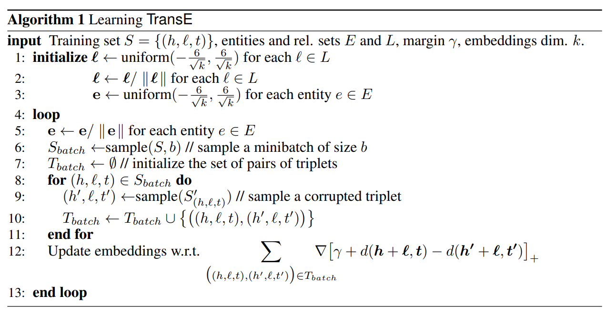

# 1. Introduction
## 1.1 Scenario
Short-Term Renting business (STR) is hard, but without the right monitoring tools for customer satisfaction, it is even harder (then it has to be). 
This Project utilizes modern Knowledge-Graph-based Approaches to assist hotels and short-term rental businesses in **identifying key issues** regarding their cleaning services and customer satisfactions. 
In particular, it is aiming at identifying if certain appartements or cleaning personals form clusters/sources of extrem good or bad customer experiences.

### 1.1.1 Proposed Analytics and Solutions
For this reason, this project provides a presentation layer (via a `streamlit` application) that displays the following information to the user: 
- A list of cleaning personal that is linked to the best/worst customer experiences. 
- A list of apartments that are linked to the best/worst customer experiences.
- An analysis to identify if certain cleaning people or appartements became a central node in a node of bad customer experiences or form a cluster utilizing utilizing *Deep Modularity Networks*.
- A list of cleaners that are assumed to have a high record of bad cleaning quality, which is determined through the use of a Graph Embedding-Technique (*TransE*) that learns whether a review indicates a bad cleaning quality. 

Eventually, this insight could then be used to infer insights for improvements in cleaning protocols, appartements and eventually customer satisfaction. 

## 1.2 Background
In the hotel/STR business, a common SaaS Stack is the combination of [Kross Booking](https://www.krossbooking.com/en) that provides PMS + Channel Manager + Booking Engine in one solution, in combination with [TimeTac](https://www.timetac.com/en/) that allows 
for smart time tracking of all internal (cleaning) processes. 
While the above is great for managing daily operations, the amount of data insight that can be extracted out of the box is pretty limited and. 
Hence, business owners of certain scales that use the SaaS stack described above are left with high amounts of manual analytical effort with still limited insights   
Therefore, this project tries to reduce the amount of manual effort needed, as well as to increase the quality of insight possible.


# 2. Data Source
This data that has been used to construct the KG has been  derived (as depicted later on in the architecture section) from two APIs:

## 2.1 Raw Data
### 2.1.1 Kross Booking
A plattform that works as booking engine for the management of hotels/appartements. In this case, it is used to manage all bookings (and everything related) across all appartements/hotels.
The stored data about the bookings can be fetched via a REST-API following the OpenAPI Standard.
### 2.1.2 TimeTac
A plattform that allows to track process times of (cleaning) people. In this case, it is used to track and access data about who has cleaned which apartment, when and for how long.
The stored data about cleaning durations can be fetched via a REST-API following the OpenAPI Standard

## 2.2 Additionally derived Data
   In addition, the collected reviews (via Kross Booking) are automatically translated and pre-evaluated with a sentiment model.   
### 2.2.1 Translation
   As the customers of the appartements can (and have been) writing reviews in more than 150 different languages, I had to start out by translating them to a single language.
   For this purpose, I used the `src/review_process_utils/review_translor.py` script that utilizes the `googleTrans` package to translate all reviews (if possible) to english.


### 2.2.2 Sentiment Analysis 
   In addition, for effective review analysis, a sentiment analysis utilizing [DistilRoBERTa](https://huggingface.co/j-hartmann/emotion-english-distilroberta-base)
   has been implemented to categorize the reviews along [Paul Ekman's 6 basic dimensions](https://www.paulekman.com/wp-content/uploads/2013/07/Basic-Emotions.pdf) + one neural dimension in case no particular emotion has been detected. 
   The corresponding script can be found in `src/Review_Handler.py`
   
### 2.2.3 Results
The two additional operations, the translation and sentiment analysis then yielded the following additional review data per Booking_ID for the knowledge graph: 

| Column Name            | Data Type |
|------------------------|-----------|
| Booking_ID  (PK)       | INT       |
| Translated_Review_Text | TEXT      |  
| Primary_Emotion        | TEXT      |
| Sentiment_Score        | FLOAT     |
| Cleaning_Quality       | INT       |

For simplification purposes this data is also stored in the AWS RDS. Of course arguments for storing this data in a NoSQL Table like MongoDB or AWS Dynamo DB could be made, but
due to the limited scope of this project I have decided to keep the overhead low and not setup another DB.


## 2.3 Data for the KG-Generation
Finally, the resulting data has been stored in the following ABT `ABT_BASE_TABLE_KG_GENERATION` that will be used for building the Knowledge Graph: 

| Column Name            | Data Type  | Source        |
|------------------------|------------|---------------|
| Booking_ID  (PK)       | INT        | KROSS         |
| Start_date_of_stay     | TIME STAMP | KROSS         |
| Appartement            | STRING     | KROSS         |
| Cleaner                | STRING     | TIMETAC       |
| Translated_Review_Text | TEXT       | KROSS         |
| Primary_Emotion        | TEXT       | ML Model      |
| Sentiment_Score        | FLOAT      | ML Model      |
| Quality_Indication     | INT        | Manual/TransE |  


**Side Notes:**
- For this demonstration purpose, the production data has been used and been anonymized using `src/data_anonimizer.py` and stored in `data\demo_data.csv`
- Due to my limited local computational resources, I have only selected a small sample from the original data. Nonetheless, this project has been designed in a scalable way and the entirety of the data could be easily processed with the help of more computational resources easily with a simple deployment to AWS. 


# 3. KGMS and KG Construction 
As mentioned before, the application utilizes data that has been fetched from *KROSS Booking* and *TimeTac* via their internal APIs is currently stored in a AWS RDS in multiple tables using the architecture displayed below:
<br>
<br>
<br>


<br>
<br>


In the beginning the data is being fetched from the two API's utilizing a python script that runs in a *AWS Lamda Container* that is being executed once per day (at midnight).
Once the data has been fetched successfully, is then stored in extraction tables in a *PostgreSQL* DB stored in an *AWS RDS Instance* (serving as central source of truth) and then automatically (via *AWS Lamda* again) processed into the aforementioned ABT.

In the meantime, an adapter (also running in a different *AWS Lamda Container*), is daily fetching new review data from the ABT, sends the reviews to a sentiment model (`sentiment_model.py`) that returns sentiment scores for each review.
After that, the data gets transformed into a graph-structure and then added to an on-premise *Neo4J* Database (dockerized) via a python script:  `src/KG_Building_Handler.py`.
This script iterates over every row in the ABT, transforms it based on the Ontology below and adds it to Neo4j.
In case a certain Node already exists (for example, an appartement has already been booked before), the script uses Cypher to determine this and instead of creating a new node of this kind, the already existing ndoe will be used.


Through this procedure described above, the KG is continuously fed with the newest data available and therefore constantly evolving.
The resulting KG then contains the following set of nodes and edges, per row in the original ABT:


**Side Notes:** 
- During the initial creation, the edges to the *Quality Indication* are only available for a subgroup (The training set) , as those are edges that should be learned with the help of *TransE*. 
<br>

## 3.1 Technologies used:  
Starting out, the *AWS Suite* (running *Python* and *PostgreSQL*) was chosen for data fetching, job scheduling and classic RDBS (using PostgreSQL as Single Source of Truth).
Part of the decision for this technology suit was, that it's general purpose, time proven quality, high scalability and offers wide array of utilities. 
In addition, it provides a strong architectural backbone for all kind of ML-Application, being it classic, or graph based machine learning, allowing them to flourish in harmony and synergy.


Furthermore *Neo4j* was then chose as a graph database for storing the built Knowledge Graph(s), while other database have been investigated, some being: 
- Amazons's own solution - Neptune
- Microsoft's Azure Cosmos DB
- Dgraph
- ArangoDB
- OrientDB
- ....


While each DB provided individual advantages and disadvantages, Neo4j was convincing for this project, mainly due to it's great support for graph data structure, Cypher's amazing syntax, the efficient querying and the docker support, leading to great flexibility, solid performance, and eas of use that was really appealing.
The opportunity to add Neo4j in a docker container to the existing technical infrastructure in AWS (leveraging EC2) underlines the flexibility and scalability of this technology.

In addition and out of curiosity (in Vadalog/Datalog), a **cozoDB** has also been setup (can be found in `DataLogMe`) and tested. Due to time constraints for further experiments, I nonetheless stuck to Neo4j and Cypher. 


# 4 Analytics / Methods
## 4.1 Knowledge Graph Embeddings
One very important factor for customer satisfaction in this industry is the quality of the appartement cleanings. With increasing numbers of properties under management, assessing this quality can become a very time-consuming and inefficient process.
So the idea here is to offer the business owners a application that helps to assess the quality of the appartement cleanings.
As this is a very specific use case, a general (not fine-tuned and industry specific) model like BERT is assumed to be only of limited help.
Therefore, a train-dataset (50% of the entire dataset) consisting of manually labels that indicate whether a review is concerned with cleaning issues, has been created and used to learn the *indicates_perceived_cleaning_quality* relationship from the original ontology with the help of [TransE](https://proceedings.neurips.cc/paper_files/paper/2013/file/1cecc7a77928ca8133fa24680a88d2f9-Paper.pdf) were the logic for the relationship connection should be the following:
<br>

$$
Quality_Indication(Review) = 
\begin{cases}
\text{great cleaning quality}, & \text{If good cleaning explicitly mentioned }  \\
\text{neutral cleaning quality}, & \text{If no problems mentioned in the review }  \\ 
\text{bad cleaning quality}, & \text{Else }
\end{cases}
$$

TransE has been selected as suitable model and trained/learned the following way:
<br>
<div style="display: flex; justify-content: center;">
    
</div>
<br>


The implementation can be found in `src/Embeddings_Handler.py`.

####  Embeddings Results


## 4.2 GNNs and the KG
The first analysis concerns the high density regions, and hence grouping, meaning, I want know if the entire graph can be clustered into interesting clusters
For this task I have oriented on the paper of  [Tsitsulin et.al. (2023)](https://www.jmlr.org/papers/volume24/20-998/20-998.pdf)
In this paper, the authors have compared the following different methods, including their basic properties and introduced their own Methode *Deep Modularity Networks* (**DMoN**). 

| Method   | End-to-end | Unsup. | Node pooling | Sparse | Soft assign. | Stable | Complexity |
|----------|------------|--------|--------------|--------|--------------|--------|------------|
| Graclus  | N          | Y      | Y            | Y      | N            | Y      | O(dn + m)  |
| DiffPool | Y          | Y      | Y            | N      | Y            | N      | O(dn²)     |
| AGC      | N          | Y      | Y            | N      | N            | N      | O(dn²k)    |
| DAEGC    | N          | Y      | Y            | Y      | N            | N      | O(dnk)     |
| SDCN     | N          | Y      | Y            | Y      | N            | N      | O(d²n + m) |
| NOCD     | Y          | Y      | Y            | Y      | Y            | Y      | O(dn + m)  |
| Top-k    | Y          | N      | N            | Y      | N            | Y      | O(dn + m)  |
| SAG      | N          | N      | Y            | N      | N            | N      | O(dn + m)  |
| MinCut   | Y          | Y      | Y            | Y      | Y            | N      | O(d²n + m) |
| DMoN     | Y          | Y      | Y            | Y      | Y            | Y      | O(d²n + m) |


Intrigued by their claims, I wanted to test **DMoN** on my own knowledge graph. 


Therefore, with the help of **PyTorch Geometric** I wrote a script to run this method on my onw KG.
This script can be found in `src/GNN_Handler.py`.
 **PyTorch Geometric** was chosen over other Frameworks like DGl and Graphnets due its high compatability (seamless integration into the PyTorch ecosystem), its dedicated CUDA kernels for sparse data and mini-batch, its strong community support and its research-orientation.

#### GNN Results

## 4.3 Logic Based Reasoning on the KG
After testing the effectiveness of the TransE Embeddings, logical queries have been developed and executed to answer the analytics questions proposed in the introduction:

### 4.3.1 List of cleaning personal that is linked to the best/worst customer experiences: 
For this purpose, I designed the following logical query: 
```cypher
    // Match cleaning personnel and their associated reviews and emotions
    MATCH (r:Reinigungsmitarbeiter)<-[:CLEANED_BY]-(b:Booking)-[:HAS_REVIEW]->(rev:Review)-[:HAS_EMOTION]->(em:Emotion)
    WHERE em.text IN ['joy', 'disgust'] // Filter for relevant emotions

    // Aggregate emotion counts and total cleanings
    WITH r, em.text AS emotion, count(em) AS emotionCount, count(DISTINCT b) AS totalCleanings
   ORDER BY r.name

    // Calculate joy-to-disgust ratio
    WITH r, 
         sum(CASE WHEN emotion = 'joy' THEN emotionCount ELSE 0 END) AS joyCount,
         sum(CASE WHEN emotion = 'disgust' THEN emotionCount ELSE 0 END) AS disgustCount,
         totalCleanings

    WITH r, 
         joyCount, 
         disgustCount, 
         totalCleanings,
         CASE WHEN disgustCount = 0 THEN joyCount ELSE joyCount * 1.0 / disgustCount END AS joyDisgustRatio

    // Order by joy-to-disgust ratio to rank performers
    ORDER BY joyDisgustRatio DESC

    // Return ranked list of performers with total cleanings
     RETURN r.name AS cleaner, 
            joyDisgustRatio AS ratio, 
            totalCleanings
```


### 4.3.2 List of apartments that are linked to the best/worst customer experiences.
For this purpose, I designed the following logical query: 

```cypher
    // Match apartments and their associated reviews and emotions
    MATCH (a:Appartment)<-[:HAS_BOOKED_APPARTEMENT]-(b:Booking)-[:HAS_REVIEW]->(rev:Review)-[:HAS_EMOTION]->(em:Emotion)
    WHERE em.text IN ['joy', 'disgust'] // Filter for relevant emotions

    // Aggregate emotion counts and total bookings 
    WITH a, 
         em.text           AS emotion, 
         count(em)         AS emotionCount, 
         count(DISTINCT b) AS totalBookings
   ORDER BY a.name

   // Calculate joy-to-disgust ratio
   WITH a, 
        sum(CASE WHEN emotion = 'joy' THEN emotionCount ELSE 0 END) AS joyCount,
        sum(CASE WHEN emotion = 'disgust' THEN emotionCount ELSE 0 END) AS disgustCount,
        totalBookings

   WITH a, 
        joyCount,
        disgustCount, 
        totalBookings,
        CASE WHEN disgustCount = 0 THEN joyCount ELSE joyCount * 1.0 / disgustCount END AS joyDisgustRatio

   // Order by joy-to-disgust ratio to rank apartments
    ORDER BY joyDisgustRatio DESC

   // Return ranked list of apartments with total bookings
   RETURN a.name          AS apartment, 
          joyDisgustRatio AS ratio, 
          totalBookings

```


### 4.3.3 A analysis to identify if certain cleaning people or appartements became a central node in a node of dissatisfaction or form a cluster.
I identified this via: 

```cypher
    // Find clusters of dissatisfaction based on negative emotions
    MATCH (a:Appartment)<-[:HAS_BOOKED_APPARTEMENT]-(b:Booking)-[:HAS_REVIEW]->(rev:Review)-[:HAS_EMOTION]->(em:Emotion)
    WHERE em.text = 'disgust'
   RETURN a.name AS apartment, count(DISTINCT b) AS bookingsWithDisgust
    ORDER BY bookingsWithDisgust DESC;
```

``` cypher
     // Similarly for cleaning personnel
     MATCH (r:Reinigungsmitarbeiter)<-[:CLEANED_BY]-(b:Booking)-[:HAS_REVIEW]->(rev:Review)-[:HAS_EMOTION]->(em:Emotion)
     WHERE em.text = 'disgust'
    RETURN r.name AS cleaner, count(DISTINCT b) AS bookingsWithDisgust
     ORDER BY bookingsWithDisgust DESC;
```


### 4.3.4 I could add a tag of "High Performers" and "Low Performers"

### 4.3.5 I could add tags for the appartments: Problematic/Unproblementic appartments

### 4.3.6 Evolvment of the Knowledge Graph
- Does it update/correct the KG? 

### 4.3.7 Context and Limitations
- Scaling? 
- how to make it scaleable?
- 
### 4.3.7 Results/Summary of Logic-based Representation
The results of 4.2.1 - 4.2.3 can be viewed in a streamlit application that can be started via navigating into `src` and and 
running 
```
python streamlit run Logic_Analysis_Dashboard.py
```


# 5 Results: 


## 5.1 Presentation Layer: 
In order to present the determined results, I decided to use *Streamlit* to create a small dashboard, that can then be used 
in a real life application as **customer satisfaction and cleaning quality monitor**
I chose *Streamlit* mainly due to its ease of use, its excellence when it comes to rapid prototyping that still comes with very good user experience that can be designed in a typical pythonic way.
The thereby built dashboard can be found under `src/dashboards/monitoring_dashboard.py`


## 5.2 Reflections: 


# PS: How to use: 
1. Start the Neo4j database via: 
```shell
docker-compose up -d
```

2. Install all needed packages from  the `requirements.txt`
3. Fill the Neo4j database with the (demo) data
   In case you want to work with the demo data, just run the `populate_KG_with_demo_data` function in `src/KG_Building_Handler.py`.

et voilà, visit http://localhost:7474/browser/ for the Neo4j Database and `TDB` for the *Streamlit Dashboard*.
Enjoy the show


### How to use Logic-based Reasoning:
Logic-bases reasoning  as described below, can be applied to the KG by running the `run_logic_based_reasoning()` function in `src/perform_analysis.py`.
The results will be presented in a dedicated streamlit dashboard that can started by running `streamlit run src/dashboards/LBR_dashboard.py`


### How to use Graph Neural Networks
Deep neural network reasoning  as described below, can be applied to the KG by running the `run_GNN_reasoning()` function in `src/perform_analysis.py`.
The results will be presented in a dedicated streamlit dashboard that can started by running `streamlit run src/dashboards/GNN_dashboard.py`


 https://distill.pub/2021/gnn-intro/